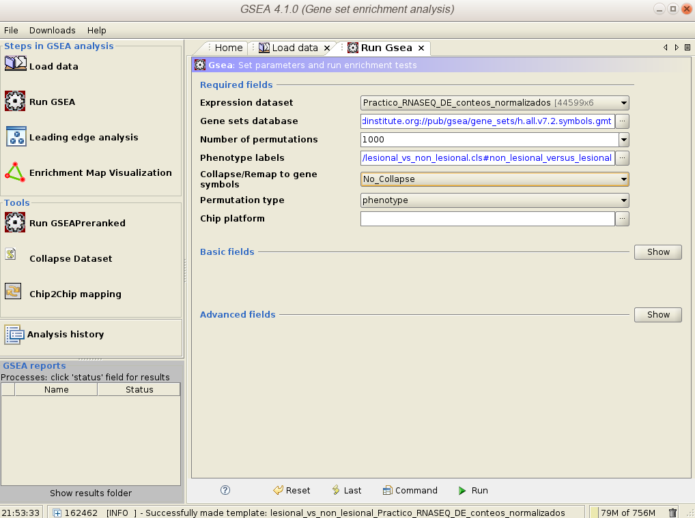

# Receta para el análisis de rnaseq

Tutorial RNA-Seq y Expresión Diferencial

## Objetivos:

El siguiente tutorial tiene como objetivo introducir al alumno en el análisis bioinformático de 
experimentos de secuenciación provenientes de RNA-Seq.

Se realizarán las siguientes tareas:

- Control de Calidad de los reads con [__FastQC__](https://www.bioinformatics.babraham.ac.uk/projects/fastqc/).
- Alineamiento de los reads a un genoma de referencia con el programa [__STAR__](https://academic.oup.com/bioinformatics/article/29/1/15/272537).
- Generación de un índice para el archivo de mapeo en formato [__BAM__](https://en.wikipedia.org/wiki/Binary_Alignment_Map) con [__SAMtools__](https://en.wikipedia.org/wiki/SAMtools). 
- Conversión de los archivos a conteo por genes [__HTSeq__](https://htseq.readthedocs.io/en/master/).
- Análisis de los conteos con [__DeSeq2__](https://bioconductor.org/packages/release/bioc/html/DESeq2.html).
- Enriquecimiento de Categorías [__GO__](http://geneontology.org/).
- Gene Set Enrichment Analysis [__GSEA__](https://www.gsea-msigdb.org/gsea).

 
## Materiales:

Una buena fuente de Datos de Expresión es el [Gene Expression Atlas](https://www.ebi.ac.uk/gxa/home) de [EBI](https://www.ebi.ac.uk)

En este tutorial utilizaremos datos descargados desde Genbank, encontrados en este Atlas.
| Link | Nombre |   
| ----- | ---- |
|[E-GEOD-41745](https://www.ebi.ac.uk/gxa/experiments/E-GEOD-41745/)| Transcriptional Profiling of Psoriasis Using RNA-seq Reveals Previously Unidentified Differentially Expressed genes |


Ustedes utilizarán los siguientes datos:


|Grupo| Link | Nombre |   
| ----- | ----- | ----- |
|1|[E-GEOD-33294](https://www.ebi.ac.uk/gxa/experiments/E-GEOD-33294/) |	Transcriptome sequencing of human hepatocellular carcinoma |
|2|[E-GEOD-54505](https://www.ebi.ac.uk/gxa/experiments/E-GEOD-54505/)  |	TWIST1-induced microRNA-424 drives an intermediate epithelial-to-mesenchymal transition that opposes metastasis | 
|3|[E-GEOD-62854](https://www.ebi.ac.uk/gxa/experiments/E-GEOD-62854/)	| Transcription profiling by high throughput sequencing in PER2 mutant of human endometrial stromal cells |
|4|[E-GEOD-58326](https://www.ebi.ac.uk/gxa/experiments/E-GEOD-58326/)	| Transcription profiling by high throughput sequencing of ZNF217 chromatin occupancy in the breast cancer cell genome |
|5|[E-GEOD-54846](https://www.ebi.ac.uk/gxa/experiments/E-GEOD-54846/)	| RNA-seq from control and macroH2A1-depleted IMR90 primary human lung fibroblasts |
|6|[E-GEOD-40131](https://www.ebi.ac.uk/gxa/experiments/E-GEOD-40131/)	| Transcription profiling by high throughput sequencing of human monocytes treated with synthetic cationic peptide IDR-1018 * Reads de 34bp |

Los datos ya se encuentran en el servidor y no es necesario descargarlos nuevamente, se ponen los link a disposición para que pueda identificar de donde se obtienen los datos en las bases de datos internacionales y para que puedan descargar metadata y artículo asociado a la investigación.


### Genoma de Referencia:

Como vimos en clase se necesitan dos datos:
El genoma de referencia y la anotación en un formato como el [GFF](https://github.com/The-Sequence-Ontology/Specifications/blob/master/gff3.md). 
En este caso, para la anotación utilizaremos el formato [Gene Transfer Format GTF](http://mblab.wustl.edu/GTF22.html) que es una derivación del formato 'GFF'. Al igual que el 'GFF' está tabulado, 
pero contiene algunas convenciones que son especificas del atributo gene del 'GFF'.

En el artículo, se utilizó la versión [GRCh37] del Genoma Humano, en nuestro caso utilizaremos la última versión del Genoma correspondiente a la [GRCh38.p13](https://www.ncbi.nlm.nih.gov/assembly/GCF_000001405.39) liberado en febrero del 2019. 

El ftp con la data la puede encontrar en el siguiente [__FTP__](http://ftp.ncbi.nlm.nih.gov/genomes/all/GCF/000/001/405/GCF_000001405.39_GRCh38.p13) (Ya se encuentra descargado).


### Reads:

Los reads están alojados en las carpetas de su grupo en el servidor del curso.
De todas maneras, si los quiere descargar, puede encontrar los id en el link de su grupo. En el caso de este práctico los reads están en esta [tabla](https://www.ebi.ac.uk/gxa/experiments-content/E-GEOD-41745/resources/ExperimentDesignFile.RnaSeq/experiment-design) \(SRR605000-SRR605005\). Con los ID SRR se pueden descargar utilizando la suite de NCBI-SRA [sra-tools](https://github.com/ncbi/sra-tools), específicamente la herramienta [fasterq-dump](https://github.com/ncbi/sra-tools/wiki/HowTo:-fasterq-dump).

### Software:

- Para el filtrado de los reads utilizaremos [TrimGalore](https://github.com/FelixKrueger/TrimGalore/blob/master/Docs/Trim_Galore_User_Guide.md).
- Para el alineamiento de los reads filtrados utilizaremos [STAR](https://github.com/alexdobin/STAR).
- Para generar el conteo a partir de los archivos 'BAM' (que es la forma binaria de un [SAM](https://samtools.github.io/hts-specs/SAMv1.pdf))
utilizaremos [HTSeq](https://htseq.readthedocs.io/en/release_0.11.1/).
- Para el analisis de expresión diferencial utilizaremos [DESeq2](http://bioconductor.org/packages/release/bioc/html/DESeq2.html).
- Exploraremos un análisis de Enriquecimiento de las categorias [GO](http://geneontology.org/docs/ontology-documentation/)
- Analizaremos nuestros resultados con [GSEA](https://gsea-msigdb.org).

# Inicio del Práctico

## Quality Check de los Reads

Utilizaremos Trim Galore para hacer un quality check y filtrar los reads de las muestras, entonces para cada archivo de reads podríamos ejecutar el comando:

			trim_galore --length 37  --quality 30 <READSFILE.fastq>


Ese comando filtrará todos los reads que tengan un largo menor a `37bp` (~50% del read, dado que son reads de 75bp) y un [phred quality value](https://www.illumina.com/documents/products/technotes/technote_Q-Scores.pdf) menor a `30`. 


Recordemos la tabla de phred Quality:

| Valor Phred| Probabilidad de base errónea | Precisión |  
| ----- | ---- |----|
| 10 | 1 en 10 | 90% |
| 20 | 1 en 100 | 99% |
| 30 | 1 en 1000 | 99.9% |
| 40 | 1 en 10000 | 99.99% |
| 50 | 1 en 100000 | 99.999% |

El resultado del comando nos entregará los reads filtrados con extensión `trimmed.fq` y un log con extensión `fastq_trimming_report.txt`


Sin embargo, es más fácil hacer un script que nos permita realizar este trabajo repetitivo de una sola vez, para esto necesitamos primero una lista con todos nuestros fastq, los podras encontrar en `/mnt/md0/curso/home/<GRUPO>/RNASEQ/reads/` (donde `<GRUPO>` es el usuario con el que se conecta por ssh):

		ls *.fastq > lista

Luego utilizando está lista, ejecutamos el script que programé que permite ejecutar TrimGalore para 4 archivos simultáneos:

		run_trim.pl -f lista -l <largo hasta 50% del read> -q <calidad mínima>

Donde `<largo hasta 50% del read>` corresponde al 50% de los reads, por ejemplo si su read mide 100 es 50, 80 es 40 y así.
Calidad `<calidad mínima>` corresponde a la calidad phred.


## Alineamiento / Mapeo de los reads al genoma de referencia.

# Importante esto no se debe ejecutar en el servidor, Generar el índice demora mucho tiempo y ya está construido. Esta sección es para que sepan como se hace.

### Generación de un índice del Genoma

Para mapear los reads al genoma de referencia los alineadores deben generar un índice del genoma. Esto permite que el proceso de mapear millones de reads se haga de forma eficiente.

La carpeta `/mnt/md0/curso/home/<GRUPO>/RNASEQ/genome/` contiene los archivos del genoma humano, el archivo fasta de
los cromosomas y la anotación de los genes en formato `GTF`. Estos fueron  descargados desde el ftp de NCBI: 
ftp://ftp.ncbi.nlm.nih.gov/genomes/all/GCF/000/001/405/GCF_000001405.39_GRCh38.p13

Dado que la indexación del genoma humano demora tiempo, es recomendable crear una nueva screen como en los prácticos anteriores:

	screen -S index


 `STAR` genera el índice  de la siguiente manera:

	STAR --runMode genomeGenerate --genomeDir /mnt/md0/curso/home/<GRUPO>/RNASEQ/genome/ --genomeFastaFiles /mnt/md0/curso/home/<GRUPO>/RNASEQ/genome/GCF_000001405.39_GRCh38.p13_genomic.fna --sjdbGTFfile /mnt/md0/curso/home/<GRUPO>/RNASEQ/Genome/GCF_000001405.39_GRCh38.p13_genomic.gtf --sjdbGTFtagExonParentTranscript Parent --sjdbOverhang 99 --runThreadN 8

Todos los resultados quedarán guardados en la dirección dada al parámetro `--genomeDir`

Con respecto a las opciones/parámetros utilizadas:

| Parámetro | Descripción |
| ---- | ---- |
| `--runMode` | indica el tipo de opcion que utilizará STAR, en este caso queremos generar un índice del genoma por lo que utilizamos la flag `genomeGenerate`|
| `--genomeDir` | indica donde se guardaran los resultados del indice y la ubicación de los archivos del genoma |
| `--genomeFastaFiles` | indica donde estan almacenadas las secuencias del genoma en formato `FASTA` |
| `--sjdbGTFfile` | sj: splice junction db: database GTFfile: archivo GTF indica la ubicación del archivo GTF para mejorar e improvisar el mapeo dado el modelo de los genes |
| `--sjdbOverhang` | Especifica el largo a considerar de la secuencia genómica alrededor del splice junction, este valor esta ligado al largo de los reads y deberia ser `max(ReadLength) - 1`  |
| `--runThreadN` | total de hebras que se ejecutaran en paralelo, este número no debe sobrepasar la cantidad de cores que tiene un computador y pruebas de escalamiento deberian ser ejecutadas para calcular el óptimo |


# Reanudamos el práctico

### Mapping

Dado que se genera el índice de los cromosomas y el genoma, ahora debemos proceder a mapear los reads que pasaron los filtros de calidad.

Para eso `STAR` utiliza:

	STAR --genomeDir /mnt/md0/curso/home/<GRUPO>/RNASEQ/genome/ --readFilesIn <READSFILE>_trimmed.fq --runThreadN 8 --outSAMtype BAM SortedByCoordinate --outFileNamePrefix <READSFILE>_trimmed

Donde `<GRUPO>` es su grupo y <READSFILE> corresponde al id SRR de un archivo FASTQ. Debe ejecutar esto para cada SRR.

| Parámetro | Descripción |
| ---- | ---- |
| `--readFilesIn` | archivo de reads a mapear |
| `--genomeDir` | indica donde esta alojado el genoma |
| `--runThreadN`| cantidad de hebras |
| `--outSAMType`| tipo de archivo `SAM` o `BAM` en este caso indicamos `BAM`|
| `SortedByCoordinate`| Ordenar el archivo BAM por las coordenadas del genoma |
| `--outFileNamePrefix`| Prefijo para los archivos de salida |

Para mayor información sobre `STAR` puede visitar el [manual](https://github.com/alexdobin/STAR/blob/master/doc/STARmanual.pdf) 


Este proceso generará un archivo `BAM` que en mi caso queda nombrado: `<READSFILE>_trimmedAligned.sortedByCoord.out.bam` y  que contiene los reads mapeados al genoma. Debera repetir el proceso para cada READSFILE, es decir (un total de 6 veces).

##Generar los conteos

El `BAM` generado tiene las posiciones y el detalle de cada read mapeado a nuestro genoma de referencia,
pero para calcular las estadísticas del mapeo necesitamos antes, generar un indice con el programa samtools.
Entonces para cada bam generararemos un archivo bam.bai (índice del bam)
	
		samtools index <READSFILE>_trimmedAligned.sortedByCoord.out.bam
	
Luego, necesitaremos un programa que nos permita transformar el detalle del mapeo, el índice y el GFF en 
en un simple archivo de abundancia de reads por gen. Para esto utilizaremos [HTSeq](https://htseq.readthedocs.io/en/release_0.11.1/).

		 htseq-count -s no -r pos -t exon -f bam  <BAMFILE> <GTF> > <SALIDA>
	
:warning: Fíjese en el ` > ` antes de `<SALIDA>` en la línea de comando superior.
	
Donde: `<BAMFILE>` corresponde a un archivo bam de salida del mapeo por STAR. `<GTF>` es el GTF del genoma que se encuentra en `/home/<GRUPO>/RNASEQ/Genome/GRCh38.p13.gtf` y `<SALIDA>` será un archivo de salida, en mi caso los nombré:
<ul>
<li> SRR605000_trimmedAligned.sortedByCoord.out.bam.htseq.out</li>
<li> SRR605001_trimmedAligned.sortedByCoord.out.bam.htseq.out</li>
<li> SRR605002_trimmedAligned.sortedByCoord.out.bam.htseq.out</li>
<li> SRR605003_trimmedAligned.sortedByCoord.out.bam.htseq.out</li>
<li> SRR605004_trimmedAligned.sortedByCoord.out.bam.htseq.out</li>
<li> SRR605005_trimmedAligned.sortedByCoord.out.bam.htseq.out</li>
</ul>

Ok, acabamos de terminar de trabajar con los grandes volúmenes de datos de secuenciación, hemos terminado con un archivo 
pequeño que contiene los reads de cada experimento mapeados al genoma de referencia. Esto puede ser trabajado en su computador personal.

Para esto tendrá que ejecutar un scp desde el servidor hasta una carpeta de su computador. __Esta carpeta será importante porque se la 
entregaremos a DESeq2 para que haga los cálculos de expresión diferencial a partir de nuestros conteos.__
Por ejemplo en un computador con un sistema basado en UNIX podría generar una carpeta en su home llamada RNASEQ

```bash
	mkdir /home/<usuario>/RNASEQ
```

donde `<usuario>` es su nombre de usuario.


```bash
	scp <USER>@<SERVER>:RNASEQ/reads/*.htseq.out /home/<usuario>/RNASEQ/
```
Donde `<USER>` es su grupo en el servidor y `<usuario>` es el nombre de la carpeta en su computador.


## Instalación de R en su computador

#### Nota: Si ya tiene instalado R, en su computador puede omitir este paso.

R es un lenguaje y ambiente para realizar estadística computacional. Puede obtener más información desde la [página del proyecto](https://www.r-project.org/)

Descargar [R-base](https://www.r-project.org/)

Descargar [RStudio](https://www.rstudio.com/products/rstudio/#Desktop)

R tiene diversos webservers y servidores que guardan información y versiones de código que ya esta programado, este repositorio se llama [CRAN - Comprehensive R Archive Network](https://cran.r-project.org).

Para bioinformática existe un repositorio particular de código de R que se llama [Bioconductor](https://www.bioconductor.org/)

## Preparando para el Cálculo de Expresión Diferencial

Lo siguientes bloques de código será código a ejecutar en RStudio:


Necesitaremos unas bibliotecas para graficar:

```R
install.packages("RColorBrewer")
install.packages("gplots")
install.packages("ggplot2")
```

Para calcular la expresión diferencial necesitaremos la librería de R [DESeq2](https://www.bioconductor.org/packages/release/bioc/html/DESeq2.html). La publicación que detalla la metodología implementada en DESeq2 la puede encontrar [acá](https://www.ncbi.nlm.nih.gov/pmc/articles/PMC4302049/pdf/13059_2014_Article_550.pdf)


Para instalar los paquetes ejecute el siguiente código:

```R
if (!requireNamespace("BiocManager", quietly = TRUE))
	install.packages("BiocManager")

BiocManager::install("biomaRt")
BiocManager::install("DESeq2")
```

	
 Cargaremos todos los paquetes que utilizaremos en el práctico
 
```R
library("DESeq2")
library("data.table")
```

Establecemos una ubicación donde trabajaremos, esta por conveniencia 
será la carpeta que definimos anteriormente

```R

carpeta <- "/home/dtravisany/RNASEQ/"
setwd(carpeta)

```

Donde `dtravisany` es el nombre de usuario

Definiremos un prefijo que le pondremos a todos nuestros archivos de salida del análisis

```R

outputPrefix <- "Practico_RNASEQ_DE"

```

Ahora cargaremos los archivos que estan alojados en la variable carpeta

```R
sampleFiles<- c("SRR605000_trimmedAligned.sortedByCoord.out.bam.htseq.out",
                "SRR605001_trimmedAligned.sortedByCoord.out.bam.htseq.out",
                "SRR605002_trimmedAligned.sortedByCoord.out.bam.htseq.out",
                "SRR605003_trimmedAligned.sortedByCoord.out.bam.htseq.out",
                "SRR605004_trimmedAligned.sortedByCoord.out.bam.htseq.out",
                "SRR605005_trimmedAligned.sortedByCoord.out.bam.htseq.out")
```

Ahora estableceremos un nombre para cada muestra, lo sacaremos del archivo  
descargado desde [GXA](https://www.ebi.ac.uk/gxa/)

En este caso he optado por asignar el nombre utilizando Tejido, Número de Paciente y fenotipo
quedando de la siguiente manera: `Tejido_NumeroPaciente_fenotipo`
es muy importante que el nombre que pongamos acá este en perfecta relación
con el nombre de los archivos de arriba, esto hay que revisarlo en la sección
[Experiment Design](https://www.ebi.ac.uk/gxa/experiments/E-GEOD-41745/Experiment%20Design) o en la tabla [experiment_design](https://www.ebi.ac.uk/gxa/experiments-content/E-GEOD-41745/resources/ExperimentDesignFile.RnaSeq/experiment-design)

```R

sampleNames <- c("skin_1_non_lesional",
                 "skin_2_non_lesional",
                 "skin_3_non_lesional",
                 "skin_1_lesional",
                 "skin_2_lesional",
                 "skin_3_lesional")

```

Ahora estableceremos las condiciones de cada muestra 

```R

sampleCondition <- c("non-lesional","non-lesional","non-lesional","lesional","lesional","lesional")

```
Agregaremos toda esta info a un Data Frame (Tabla)

```R

sampleTable <- data.frame(sampleName = sampleNames, fileName = sampleFiles, condition = sampleCondition)

```

Estableceremos cuales son los tratamientos:
```R

treatments = c("non-lesional","lesional")

```


__Hasta ahora solo hemos preparado los datos para realizar 
 la expresión diferencial.__


# Expresión diferencial

Como utilizamos htseq para realizar los conteos, 
podremos acceder a comandos especiales de __DESeq2__ para el tratamiento
desde archivos de conteo provenientes de este software. 
Es útil ver el [manual para esta sección](http://bioconductor.org/packages/release/bioc/vignettes/DESeq2/inst/doc/DESeq2.html#htseq-count-input)

#entregamos el dataframe, la carpeta que establecimos al principio
 y las condiciones que estan en la tabla como condition.

```R

ddsHTSeq <- DESeqDataSetFromHTSeqCount(sampleTable = sampleTable,
                                       directory = carpeta,
                                       design = ~ condition)
colData(ddsHTSeq)$condition <- factor(colData(ddsHTSeq)$condition,
                                      levels = treatments)


```

Ahora ejecutamos la expresión Diferencial:

```R
dds <- DESeq(ddsHTSeq)
res <- results(dds)

```
Ahora sacaremos los genes DE con un p-valor 
ajustado < 0.05 y ordenados de menor p-valor-ajustado a mayor p-valor-ajustado:

```R

res= subset(res, padj<0.05)
res <- res[order(res$padj),]

```

Guardaremos nuestros resultados en archivos CSV.


```R
resdata <- merge(as.data.frame(res), as.data.frame(counts(dds,normalized =TRUE)), by = 'row.names', sort = FALSE)
names(resdata)[1] <- 'gene'
write.csv(resdata,quote=FALSE, row.names=FALSE, file = paste0(outputPrefix, "-resultados-normalizados.csv"))

# Conteos Normalizados compatibles con GSEA.
table=as.data.frame(counts(dds),normalized=T)
table2=setDT(table,keep.rownames = TRUE)[]
colnames(table2)[1]<-"gene"

write.table(table2, sep="\t" , quote=FALSE, row.names = FALSE,  file = paste0(outputPrefix, "_conteos_normalizados.txt"))

```

Ahora tendremos dos archivos, el primero es nuestra expresión diferencial (OUTPUTPREFIX-resultados-normalizados.csv):

### En su informe deberá describir algunos de los genes diferencialmente expresados que estén relacionados con la investigación y compararlos con los resultados del artículo.

## Enriquecimiento de Categorias GO:
 
Para el enriquecimiento utilizaremos una herramienta simple: [GOrilla](http://cbl-gorilla.cs.technion.ac.il/)

(Si quiere utilizar una herramienta más avanzada puede ir directamente a la página de [GO](www.geneontology.org) y copiar y pegar su lista de genes DE).

Sacamos desde el archivo OUTPUTPREFIX-resultados-normalizados.csv, la columna de genes.


En GOrilla ajecutaremos el Enrichment Analysis para las categorias GO. 


<ul>
<li> En step 1, donde está la flecha <- roja, seleccionamos Homo sapiens.</li>
<li> En step 2, donde está la flecha <- calipso, seleccionamos Single ranked list of genes.</li>
<li> En step 3, donde está la flecha <- verde, pegamos la columna copiada desde nuestro archivo en el paso anterior y borramos "genes".</li>
<li> En step 4, donde está la fecha azul, seleccionamos todas las ontologías.</li>
<li> Donde indica la flecha naranja apretar el boton Search Enriched GO terms.</li>
</ul>

### En el informe deberá mostrar las figuras e interpretar los resultados de las 3 categorias [Molecular Function, Biological Process y Cellular Component](http://geneontology.org/docs/ontology-documentation/).


Acá puede ver uno de los resultados de GOrilla para Celullar Component:


Podemos ver que una de las categorías enriquecidas corresponde a cornified envelope: El experimento que estamos analizando es de células de piel lesionadas y no lesionadas en pacientes con Psoriasis y podemos ver que [Cornified Envelope corresponde a un modelo de muerte celular en la piel](https://www.nature.com/articles/nrm1619). Lo que ya nos guía a una interesante discusión.
 
### El archivo de conteos lo utilizaremos para realizar un Gene Set Enrichment Analysis: 


El archivo de conteos lo cargaremos en GSEA. Para esto es necesario descargar GSEA. (Debe darse de alta en la página para descargarlo [aquí](https://www.gsea-msigdb.org/gsea/login.jsp)).

En mi caso (UBUNTU 18.04 LTS) descargué la versión `GSEA_Linux_4.1.0.zip`.

Descomprima GSEA y ejecútelo, en mi caso lo ejecuté desde un terminal entrando a la carpeta descomprimida y ejecutando: `sh gsea.sh`


#### Cargue los datos en GSEA: 


#### No debe haber error:


#### Haga Click en Run GSEA y en Expression Dataset seleccione el archivo que cargó y en Gene set database seleccione la primera opcion: 
Una descripción de las opciones la puede encontrar [acá](https://www.gsea-msigdb.org/gsea/msigdb/collections.jsp). Siéntase libre de repetir esta parte explorando otras colecciones como ubicaciones en bandas citogenéticas.


#### En Select a Phenotype seleccione `Create an on-the-fly phenotype`:


#### Debe rellenar la información de las clases A y B en este caso `LESIONAL`  y `NON_LESIONAL`, además de las muestras que tienen las condiciones:


#### Debe Cargarse Exitosamente:


#### Ahora Seleccione un tipo de comparación VS y apretar OK:


#### En `Collapse/Remap to gene symbols` seleccione `No_Collapse`: 



#### En Select Chip seleccione el chip Human_RefSeq_Accession_MSigDB.v7.2.chip:


#### Hacer click en |> RUN  en el menú de abajo, después de unos instantes comenzará a descargarse el chip y verá en el borde inferior izquierdo en la sección GSEA Reports el status Running en azul.


#### Al terminar el status deberá decir Success en verde:


#### Al hacer click en el status deberá aparecer un reporte como el siguiente:


#### Si nos vamos a snapshot Podremos ver un conjunto de categorías enriquecidas:


Ahora deberá describir algunas categorías enriquecidas en su informe así como mostrar algunos Blue-Pink O'Gram de la colección HallMark y/o alguna otra elegida por usted.


